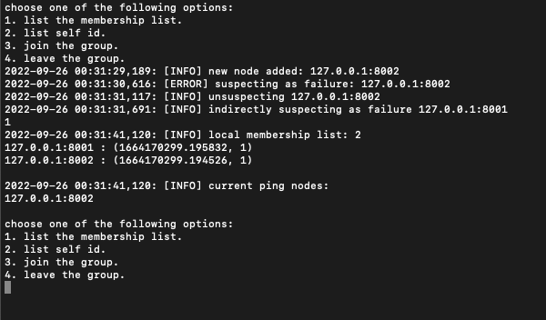
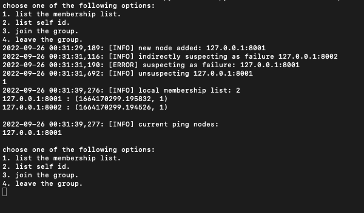

# AwesomeFailureDetector

Awesome Failure Detector is a Ring failure detector which can be configured to monitor any number of machines by just providing all the nodes information and the Ring topology of the whole system. The AwesomeFailureDetector provides additional configuration which can tune the Completeness and Accuracy of the system. The AwesomeFailureDetector allows a node to run as a introducer which helps other nodes to fetch the current membership list and initilize itself.


## Usage

### STEP-1

Edit the `config.py` file with the information about all the available nodes and the GLOBAL_RING_TOPOLOGY for all the nodes.

Enter the `hostname` or `IP` and `Port` for the node tobe monitor.

```python

H1: final = Node('127.0.0.1', 8001, 'H1')
H2: final = Node('127.0.0.1', 8002, 'H2')
H3: final = Node('127.0.0.1', 8003, 'H3')
H4: final = Node('127.0.0.1', 8004, 'H4')
H5: final = Node('127.0.0.1', 8005, 'H5')
H6: final = Node('127.0.0.1', 8006, 'H6')
H7: final = Node('127.0.0.1', 8007, 'H7')
H8: final = Node('127.0.0.1', 8008, 'H8')
H9: final = Node('127.0.0.1', 8009, 'H9')
H10: final = Node('127.0.0.1', 8010, 'H10')

GLOBAL_RING_TOPOLOGY: dict = {

    H1: [H2, H10, H5],

    H2: [H3, H1, H6],

    H3: [H4, H2, H7],

    H4: [H5, H3, H8],

    H5: [H6, H4, H9],

    H6: [H7, H5, H10],

    H7: [H8, H6, H1],

    H8: [H9, H7, H2],

    H9: [H10, H8, H3],

    H10: [H1, H9, H4]

}
```

The above example configure the failure detector to monitor 10 process running on 10 different ports locally.

### STEP-2

Once the nodes and global ring topology is updated. RUN the below command.

The `main.py` has the starter code to initialize and star the failure detector.

To run the application following options has to be passed.

`--hostname=`   : The current hostname or IP of the node.
`--port=`       : The current Port of the node.
`--introducer=` : The `<hostname>:<port>` of the introducer.
`-t`            : Which allows application to run in test mode.

> **_NOTE:_** Introducer node should be up and running before starting other nodes.

```console
$ cd ~/awesomefailuredetector
$ python3 main.py --hostname='127.0.0.1' --port=8001 --introducer='127.0.0.1:8001'
```

### STEP-3

Once the application is stated the `awesomefailuredetector` provides a console to interact with the running application with following options.

Option 1: Prints the membership list in the current node along with the nodes its pinging

Option 2: Prints the ID of the current node as `<hostname>:<port>`

Option 3: Join the current node by started sending PINGs and ACKs to other nodes.

Option 4: Leaves the node by stop sending PINGs and ACKs to other nodes.

Option 5: Print current Bytes per seconds.

Option 6: Print current False positive rate.

```console
$ python3 main.py --hostname='127.0.0.1' --port=8001 -i '127.0.0.1:8001' -t
choose one of the following options:
1. list the membership list.
2. list self id.
3. join the group.
4. leave the group.
5. print current bps.
6. current false positive rate.
1
2022-09-26 00:24:50,423: [INFO] local membership list: 1 
127.0.0.1:8001 : (1664169889.185843, 1)

2022-09-26 00:24:50,423: [INFO] current ping nodes: 
127.0.0.1:8002
127.0.0.1:8010
127.0.0.1:8005

choose one of the following options:
1. list the membership list.
2. list self id.
3. join the group.
4. leave the group.
5. print current bps.
6. current false positive rate.
```

Below is an example when there are two nodes running with their local membership lists.


